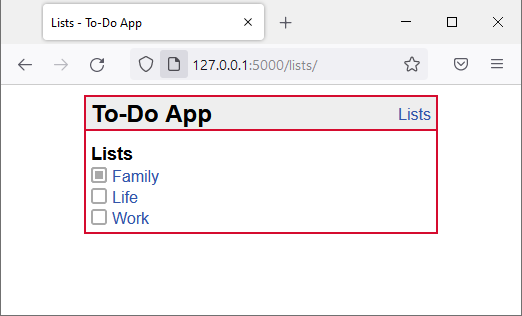
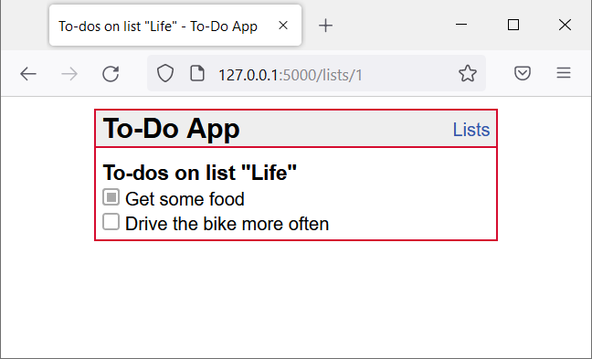

{: .label }
[Nicolas Jobstvogt, Vasco Pogade]

# [Reference documentation]
{: .no_toc }

{: .text-delta }

Table of contents

+ ToC
{: toc }

## [Section / module]

### `function_definition()`

**Route:** `/route/`

**Methods:** `POST` `GET` `PATCH` `PUT` `DELETE`

**Purpose:** [Short explanation of what the function does and why]

**Sample output:**

[Show an image, string output, or similar illustration -- or write NONE if function generates no output]

---

### `index()`

**Route:** `/`

**Methods:**

**Purpose:** Displays the users dashboard. Welcomes the user with his username and a different greeting depending on which time it is.

**Sample output:**

[Show an image, string output, or similar illustration -- or write NONE if function generates no output]

---

## [Example, delete this section] Show to-do lists

### `get_lists()`

**Route:** `/lists/`

**Methods:** `GET`

**Purpose:** Show all to-do lists.

**Sample output:**

---

### `get_list_todos(list_id)`

**Route:** `/lists/<int:list_id>`

**Methods:** `GET`

**Purpose:** Retrieve all to-do items of to-do list with ID `list_id` from database and present to user.

**Sample output:**

---

## [Example, delete this section] Insert sample data

### `run_insert_sample()`

**Route:** `/insert/sample`

**Methods:** `GET`

**Purpose:** Flush the database and insert sample data set

**Sample output:**

Browser shows: `Database flushed and populated with some sample data.`